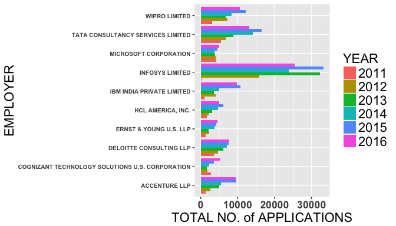
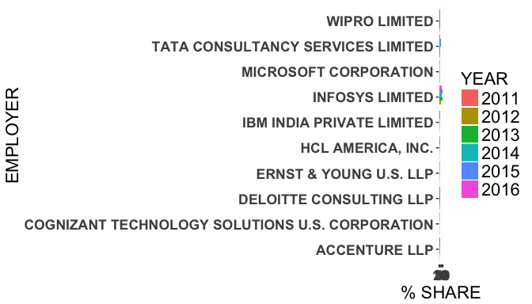
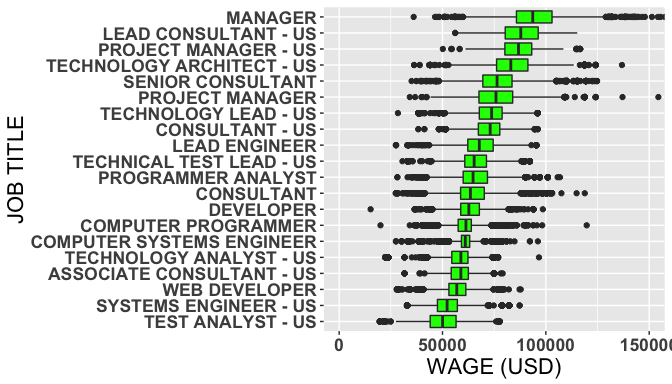
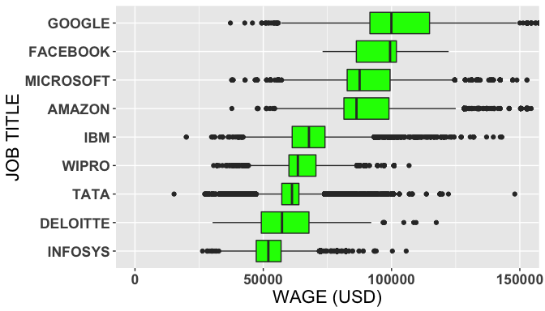
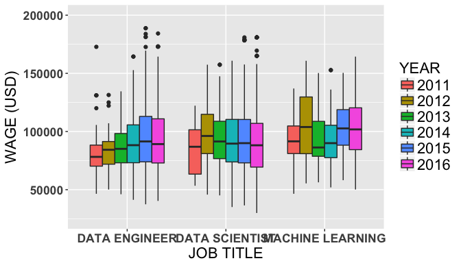
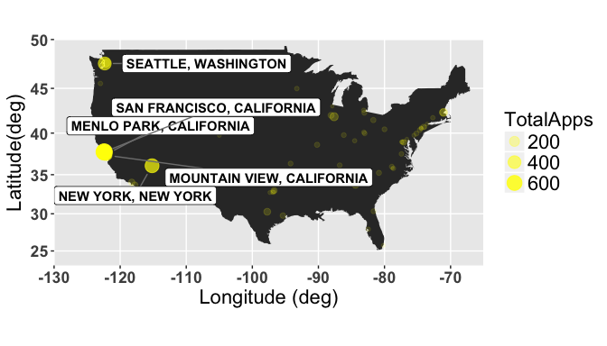
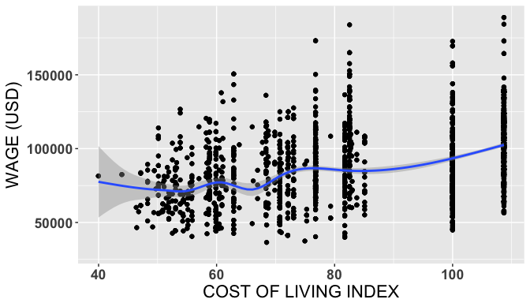

In this notebook, I will utilize the transformed data set in the notebook data\_processing.Rmd to answer interesting questions on the H-1B visa dataset. The key questions I will be covering include:

Section I. High-Applicant Employers:

1.  Which Employers send most number of H-1B visa applications?

2.  What is the Percentage share out of the 85,000 visa cap for the Employers with most applications?

3.  Most common Job Titles and their Relative wages to Industry standard as well as absolute?

Section II. Data Science related job position Analysis:

1.  Comparison of Number of applications and Wages for Data Scientist, Data Engineer and Machine Learning

Section III. Location-based analysis for Data Scientist related jobs:

1.  How does the Wage for Data Science related positions vary by state? By worksite?

2.  Are the jobs concentrated in few specific regions?

3.  Correlation between Wage and Cost of Living index?

Let's begin the analysis by loading the libraries and the dataframe!

``` r
library(dplyr)
```

    ##
    ## Attaching package: 'dplyr'

    ## The following objects are masked from 'package:stats':
    ##
    ##     filter, lag

    ## The following objects are masked from 'package:base':
    ##
    ##     intersect, setdiff, setequal, union

``` r
library(ggplot2)
library(ggrepel)
library(ggmap)
```

    ## Google Maps API Terms of Service: http://developers.google.com/maps/terms.

    ## Please cite ggmap if you use it: see citation("ggmap") for details.

``` r
source("helpers.R")
```

    ## Loading required package: lazyeval

helpers.R includes a suite of plotting and filter functions that will help us with the data analysis.

``` r
h1b_df <- readRDS("h1b_transformed.rds")

colnames(h1b_df)
```

    ##  [1] "CASE_NUMBER"         "CASE_STATUS"         "EMPLOYER_NAME"      
    ##  [4] "SOC_NAME"            "SOC_CODE"            "JOB_TITLE"          
    ##  [7] "FULL_TIME_POSITION"  "PREVAILING_WAGE"     "WORKSITE_CITY"      
    ## [10] "WORKSITE_STATE_ABB"  "YEAR"                "WORKSITE_STATE_FULL"
    ## [13] "WORKSITE"            "lon"                 "lat"                
    ## [16] "COLI"

<h2>
High-Applicant Employers
</h2>
In this sub-section, I analyze employers with high number of applications. Let's begin by finding out the top 10 employers with the most number of applications in the period 2011-2016.

It might occur that Employer Names takes most of the space leaving almost little for the actual plot. For this purpose, I cut short Employer names to only the first word in their title. An another approach might be reducing the axis.text size for ggplot2.

``` r
h1b_df$EMPLOYER_COMPACT = sapply(h1b_df$EMPLOYER_NAME,split_first,split = " ")
```

``` r
input <- plot_input(h1b_df, "EMPLOYER_NAME", "YEAR", "TotalApps",filter = TRUE, Ntop = 10)

g <- plot_output(input, 'EMPLOYER_NAME','YEAR','TotalApps', 'EMPLOYER','TOTAL NO. of APPLICATIONS') + theme(axis.title = element_text(size = rel(1.5)),
          axis.text.y = element_text(size=rel(0.85),face="bold"))
g
```



Observations:

1.  Infosys leads the pack by a huge margin with over 30000 applications in 2013 and 2015.

2.  The Top 10 list is dominated by the Indian IT companies.

3.  We observe a slight dip in the number of applications from Infosys, Wipro, Tata Consultancy, IBM India and HCL America. This is because of increased incorporation of automation in the IT industry. According to this article <https://qz.com/901292/indian-it-firms-like-wipro-tcs-and-infosys-have-been-preparing-for-changes-in-h1b-visa-laws-and-donald-trumps-america-for-several-years/>, the Indian IT firms have been preparing for nearly a decade through increased focus on automation, cloud computing and artificial intelligence.

Next, let's look at the Percentage Share of the Approved/Certified H-1B applications for these top 10 employers out of the 85000 cap.

``` r
g <- plot_output(input, 'EMPLOYER_NAME','YEAR','Share', 'EMPLOYER','% SHARE')

g
```



The assumption in this plot is that each certified H-1B application corresponds to a unique H-1B visa. Accordingly, if an employer's 8500 H-1B visa applications were certified then it's percentage share in the 85,000 visa cap is 10%. Based on this assumption, I make the following observations:

1.  Over 90% of the certified H-1B visa applications belong to the IT companies with the most applications.

2.  Infosys again takes a major share.

Next, I analyze the most common Full-Time job positions offered by the high-applicant employers. Also, I compare the wages offered by these employers to the global average for the same job positions.

``` r
# Finding the top 5 employers
top_employers <- unlist(find_top(h1b_df,"EMPLOYER_NAME","TotalApps",Ntop = 5))

#Finding the most common Job Titles with Full-Time Positions
h1b_df %>%
  filter(EMPLOYER_NAME %in% top_employers & FULL_TIME_POSITION == 'Y') %>%
  group_by(JOB_TITLE) %>%
  summarise(COUNT = n()) %>%
  arrange(desc(COUNT)) -> common_jobs
```

``` r
g <- ggplot(common_jobs[1:15,], aes(x=reorder(JOB_TITLE,COUNT),y=COUNT)) +
   geom_bar(stat = "identity", fill = "blue") + coord_flip() +
   xlab("JOB TITLE") + ylab("TOTAL NO. OF APPLICATIONS") + get_theme() + scale_color_discrete()

g
```


Let's look at the Wage distributions for the 15 most common jobs among the high-applicant companies.

``` r
h1b_df %>%
  filter(EMPLOYER_NAME %in% top_employers, JOB_TITLE %in% unlist(common_jobs$JOB_TITLE[1:20])) %>%
  group_by(JOB_TITLE) -> job_wages_df

g <- ggplot(job_wages_df, aes(x=reorder(JOB_TITLE,PREVAILING_WAGE,median),y=PREVAILING_WAGE)) +
   geom_boxplot(fill="green") + xlab("JOB TITLE") + ylab("WAGE (USD)") +
  get_theme() + coord_flip(ylim=c(0,150000))

g
```



Observations:

1.  Expectedly, the Manager level jobs and Lead Consultant job titles have the highest wages.

2.  The Software Engineering jobs including Programmer analyst, Computer Programmer, Computer Systems Engineer have wages close to 60000 USD per annum.

3.  Test Analyst and Systems Engineer have the lowest wages with the median slightly above 50000 USD.

Based on this data, it will be interesting to find out how the wages offered to Software related job titles by the high-applicant employers compares with the top Software companies like Google, Amazon, Facebook etc.

``` r
job_list <- c("Programmer","Computer","Software","Systems","Developer")

employer_list <- toupper(c("IBM","Infosys","Wipro","Tata","Deloitte","Amazon","Google","Microsoft","Facebook"))

job_filter(h1b_df,job_list) %>%
  filter(EMPLOYER_COMPACT %in% employer_list) %>%
  group_by(EMPLOYER_COMPACT) -> employer_df

g <- ggplot(employer_df, aes(x=reorder(EMPLOYER_COMPACT,PREVAILING_WAGE,median),y= PREVAILING_WAGE)) +
  geom_boxplot(fill="green") + xlab("JOB TITLE") + ylab("WAGE (USD)") +
  get_theme() + coord_flip(ylim=c(0,150000))

g
```



Observations:

1.  We can clearly see that the high-applicant employers with the most H-1B visas have significantly lower wages for Software job positions.

2.  The median wage for the IT companies is lower than 70000 USD whereas for the top software companies the median wage is above 85000 USD.

3.  Facebook and Google have a median above 100000 USD.

<h2>
Data Scientist Job Analysis
</h2>
``` r
job_list <- c("Data Scientist","Data Engineer","Machine Learning")

data_science_df <- plot_input(job_filter(h1b_df,job_list),
                              "JOB_INPUT_CLASS",
                              "YEAR",
                              "TotalApps")

h <- plot_output(data_science_df, "JOB_INPUT_CLASS","YEAR", "TotalApps", "JOB CLASS", "NO. OF APPLICATIONS")

h
```


Observations:

1.  Data Scientist and Data Engineer positions have observed an exponential growth in the last 6 years.

2.  Job Titles with Machine Learning explicitly in them are still few in number (&lt; 75 in any year).

3.  In 2016, Data Scientist position broke the 1000 barrier on the number of H-1B Visa applications.

``` r
g <- ggplot(job_filter(h1b_df,job_list), aes(x=JOB_INPUT_CLASS,y= PREVAILING_WAGE)) +
  geom_boxplot(aes(fill=YEAR)) + xlab("JOB TITLE") + ylab("WAGE (USD)") +
  get_theme() + coord_cartesian(ylim=c(25000,200000))

g
```



Observations:

1.  Machine Learning jobs have the highest median wage although the number of Job Titles with Machine Learning explicitly in them are less than 75 in any year.

2.  Median wage for Data Engineer jobs is consistently increasing.

3.  Median wage for Data Scientist positions is negligibly decreasing since 2012 although this is the position that has seen the most growth in the last 6 years.

<h2>
Location based Analysis
</h2>
I continue with the analysis for Data Scientist related jobs focusing on comparing different locations at the granularities of State and Worksite city.

``` r
ds_state_df <- job_filter(h1b_df,job_list) %>%
               group_by(WORKSITE_STATE_ABB) %>%
               summarise(WAGE = mean(PREVAILING_WAGE), N_JOBS = n()) %>%
               arrange(desc(WAGE))
```

``` r
# Focusing on states with at least 50 Data Science related jobs in the last 6 years

g <- ggplot(ds_state_df %>% filter(N_JOBS >= 50), aes(x=reorder(WORKSITE_STATE_ABB,N_JOBS), y = N_JOBS))
g <- g + geom_bar(stat="identity", aes(fill= WORKSITE_STATE_ABB))
g <- g  + scale_colour_discrete() + coord_flip() + guides(fill=FALSE) + ylab("H-1B VISA APPLICATIONS") + xlab("STATE")
g <- g + get_theme()
g
```


Observations:

1.  California leads the pack by a huge margin with over 2000 applications.

2.  New York, Washington, Massachusetts and Texas form the remaining top 5 positions.

This result is expected as these states are hub of technology innovation with California housing the Silicon Valley, NY housing the Finance and media corporations, Washington housing the technology giants including Microsoft and Amazon.

1.  Surprisingly, only 11 states passed the barrier of 50 H-1B applications related to Data Science in the last 6 years.

``` r
g <- ggplot(ds_state_df %>% filter(N_JOBS >= 50 & WORKSITE_STATE_ABB != 'MA'), aes(x=reorder(WORKSITE_STATE_ABB,WAGE), y = WAGE))
g <- g + geom_bar(stat="identity", aes(fill= WORKSITE_STATE_ABB))
g <- g  + scale_colour_discrete() + coord_flip() + guides(fill=FALSE) + ylab("WAGE (USD)") + xlab("STATE")
g <- g + get_theme()
g
```


Observations:

1.  California has not only got the most number of jobs but also the highest wages. This is mainly due to the high cost of living as I will analyze later.

2.  Significant variation in the mean wage across the states.

3.  I excluded Massachusetts as it had an weird mean Wage of 1500,000 USD per annum.

Next, I dive deeper into analyzing data science positions.at the granularity of Worksite city.

``` r
USA = map_data(map = "usa")

g <- map_gen(job_filter(h1b_df,job_list),"TotalApps",USA,Ntop = 5)
```

    ## Warning: Ignoring unknown aesthetics: label

``` r
g
```

    ## Warning: Removed 335 rows containing missing values (geom_point).



Observations:

1.  San Francisco leads the chart with the most number of jobs.

2.  Inside California, the jobs are not uniformly distributed. Instead, are mainly clustered nearby San Francisco.

Next, I analyze how the wage changes with cost of living index of worksite city.

``` r
g <- ggplot(job_filter(h1b_df,job_list) %>% filter(PREVAILING_WAGE < 200000), aes(x=COLI,y=PREVAILING_WAGE)) + geom_point()
g <- g + geom_jitter() + geom_smooth() +
  get_theme() + xlab("COST OF LIVING INDEX") + ylab("WAGE (USD)") +
  get_theme()

g
```

    ## `geom_smooth()` using method = 'gam' and formula 'y ~ s(x, bs = "cs")'

    ## Warning: Removed 2548 rows containing non-finite values (stat_smooth).

    ## Warning: Removed 2548 rows containing missing values (geom_point).

    ## Warning: Removed 2548 rows containing missing values (geom_point).



Observations:

1.  A general increase in the Wage is observed with the cost of living although there are slight dips across the curve.

2.  The standard error decreases as we move towards locations with higher cost of living index.
